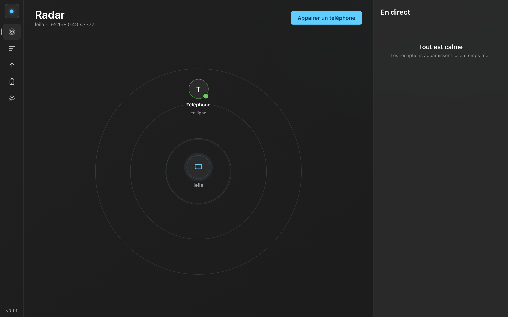
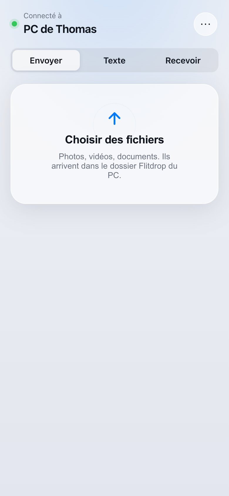
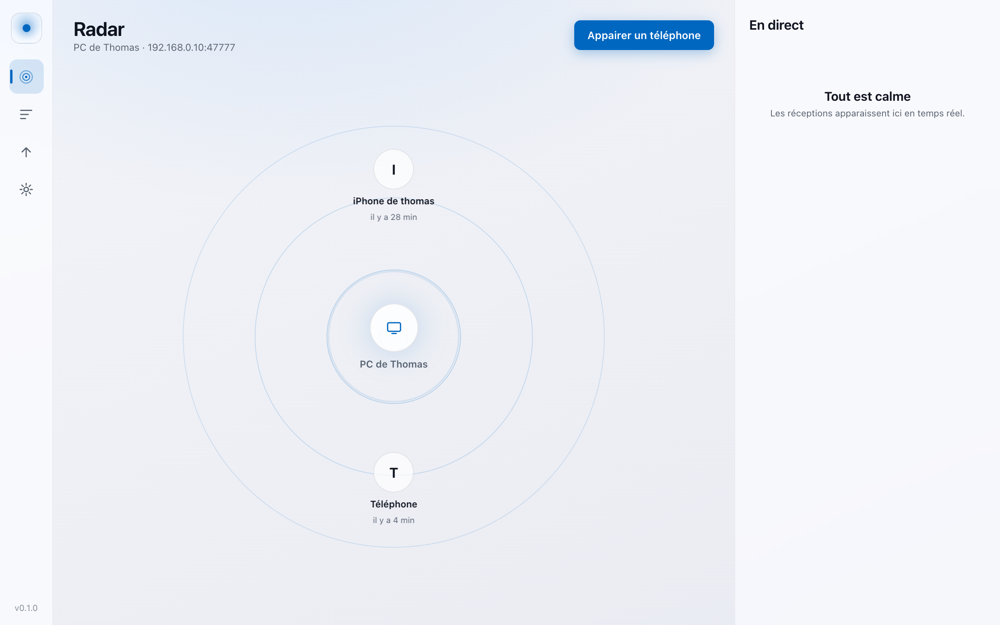

<div align="center">

# Flitdrop

### The AirDrop for Windows : send files, photos and clipboard between iPhone, Android and your PC. No app to install on the phone. End-to-end encrypted. Free on your local network.

*L'AirDrop de Windows : envoyez fichiers, photos et presse-papiers entre iPhone, Android et votre PC. Rien à installer sur le téléphone. Chiffré de bout en bout. Gratuit sur votre réseau local.*



</div>

---

## Pourquoi

Sur Mac il y a AirDrop. Sur Windows, rien d'équivalent qui soit simple, rapide et sûr : et surtout rien pour un **iPhone vers un PC sans installer d'app**. Ni Microsoft (Phone Link, noté 3,0/5 sur 460 000 avis), ni Google (Quick Share, Android seulement), ni Samsung ne couvrent ce cas. Flitdrop le fait.

- **iPhone → PC, sans rien installer sur le téléphone.** On scanne un QR code une fois, et on envoie depuis le navigateur ou un Raccourci Apple.
- **Multi-appareils.** iPhone, Android, Xiaomi, Samsung, et bien sûr Windows 11. Ça marche entre marques, là où AirDrop est bloqué à Apple.
- **Chiffré de bout en bout.** La clé est échangée par QR code, jamais sur le réseau. Pas de cloud, pas de compte.
- **Gratuit et illimité sur votre wifi.** Fichiers, photos, vidéos, texte, presse-papiers, dans les deux sens.

## Aperçu

| Téléphone (iOS 26 « Liquid Glass ») | PC (Windows 11 Fluent) |
|---|---|
|  |  |

Les deux interfaces prennent l'apparence native de leur système et suivent le mode clair/sombre.

## Fonctionnalités

- 📤 **Envoi de fichiers** iPhone/Android → PC, avec progression, vitesse, et **reprise automatique** si le réseau coupe.
- 📋 **Presse-papiers** : le texte du téléphone arrive dans le presse-papiers du PC en un tap ; et le PC peut pousser automatiquement son presse-papiers vers le téléphone ([ce qui est possible et pourquoi](docs/presse-papiers.md)).
- 📥 **PC → téléphone** : glissez un fichier dans Flitdrop, il apparaît sur le téléphone.
- 📡 **Radar** temps réel des appareils appairés, façon AirDrop.
- 📶 **Mode hors-ligne** : sans box ni internet, le PC crée son propre réseau Wi-Fi ([détails](docs/hors-ligne.md)).
- 🍎 **Raccourci Apple** « Envoyer au PC » dans la feuille de partage iOS ([guide](docs/raccourci-ios.md)).
- 🔒 **Chiffrement de bout en bout** XChaCha20-Poly1305, appairage hors bande, appareils révocables.

## Installation

**Utilisateur Windows.** Téléchargez l'installeur `.exe` depuis la [page des releases](https://github.com/MrFrosas/flitdrop/releases), double-cliquez, c'est installé. Au premier lancement, Flitdrop vous guide en trois écrans, puis affiche un QR code : scannez-le avec le téléphone, et c'est appairé pour de bon (même après un redémarrage du PC, pas besoin de re-scanner).

Une fois installé, Flitdrop ajoute **« Envoyer vers Flitdrop »** au clic-droit de l'Explorateur Windows : sélectionnez un fichier, clic-droit, Envoyer vers, Flitdrop, et il attend sur le téléphone.

**Sur le téléphone**, rien à installer. La page qui s'ouvre après le scan peut être ajoutée à l'écran d'accueil (menu ⋯ dans Flitdrop, puis « Installer sur l'écran d'accueil ») : elle se comporte alors comme une vraie app, connectée au PC, sans re-scanner.

## Comment ça marche

Le PC installe **un seul programme** : Flitdrop, qui fait tourner un petit serveur chiffré **en local**, sur votre réseau. Le téléphone lui parle par le navigateur (ou un Raccourci Apple), sur le même wifi, avec un chiffrement de bout en bout. **Aucun cloud, rien ne transite par un serveur externe.** Si le wifi n'existe pas (train, gare), le PC crée son propre réseau ([mode hors-ligne](docs/hors-ligne.md)).

## Développement

```bash
npm install
npm run dev        # serveur local + interfaces (port 47777)
npm test           # 32 tests : crypto, protocole, reprise, sécurité
npm run desktop    # application de bureau (fenêtre + icône de notification)
```

## Build Windows (installeur + Microsoft Store)

Poussez un tag `vX.Y.Z` : le workflow GitHub Actions build sur Windows et publie une release avec l'installeur. Ou en local sur une machine Windows :

```bash
npm ci
npm run build -w @flitdrop/core
npm run dist:win -w @flitdrop/desktop   # -> release/*.exe (site) + *.appx (Store)
```

## Flitdrop vs AirDrop

| Critère | Flitdrop | AirDrop |
|---|---|---|
| Fonctionne entre marques (iPhone↔PC, Samsung↔PC) | ✅ | ❌ Apple seulement |
| Sans app sur le téléphone | ✅ page web + QR | service système |
| Hors réseau (sans box) | ✅ via point d'accès du PC | ✅ radio-direct (Apple only) |
| Reprise de transfert après coupure | ✅ | ⚠️ souvent relancé |
| Réception passive app fermée sur iPhone | ❌ (réservé à Apple) | ✅ |
| Intégration Windows | ✅ | ❌ inexistant |
| Chiffrement E2E | ✅ | ✅ |

Comparatif complet et honnête : [docs/comparatif-airdrop.md](docs/comparatif-airdrop.md).

## Comment ça marche

Une app de bureau fait tourner un petit serveur local chiffré. Le téléphone lui parle en HTTP sur le réseau local (aucun serveur cloud), avec un chiffrement applicatif de bout en bout par-dessus. L'appairage par QR code échange une clé secrète qui ne transite jamais sur le réseau. Détails : [docs/architecture.md](docs/architecture.md) et [docs/securite.md](docs/securite.md).

## Documentation

- [Architecture technique](docs/architecture.md)
- [Modèle de sécurité](docs/securite.md) (+ revue d'attaque adversariale)
- [Mode hors-ligne](docs/hors-ligne.md)
- [Synchronisation du presse-papiers : la vérité](docs/presse-papiers.md)
- [Raccourci iOS pas à pas](docs/raccourci-ios.md)
- [Audit de faisabilité « expérience native »](docs/audit-faisabilite-native.md)
- [Feuille de route apps natives](docs/roadmap-apps-natives.md)
- [Publication Microsoft Store](docs/microsoft-store.md)
- [Modèle économique](docs/business.md)

## Statut

v0.1 : fonctionnel et testé (32 tests automatisés : crypto, protocole, reprise, sécurité). L'app PC et la page téléphone sont opérationnelles. Les apps mobiles natives (pour l'icône dans la feuille de partage iOS et l'envoi en veille) sont sur la [feuille de route](docs/roadmap-apps-natives.md).

## Licence

[MIT](LICENSE). AirDrop is a trademark of Apple Inc. Flitdrop is an independent project and has not been authorized, sponsored, or otherwise approved by Apple Inc.
