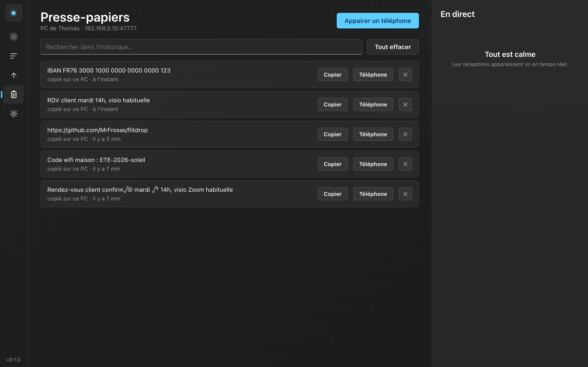

<div align="center">

# Flitdrop

### AirDrop for every device. Send files, photos and clipboard between any phone and any computer. Nothing to install on the phone. End-to-end encrypted. Free on your local network.

*Français plus bas.*


[**Download**](https://github.com/MrFrosas/flitdrop/releases/latest) · [How it works](#how-it-works) · [Flitdrop vs AirDrop](#flitdrop-vs-airdrop) · [Français](#flitdrop-en-français)

</div>

---

## Why

macOS has AirDrop. Windows has nothing as simple, and there is no easy way to send a file from an iPhone to a PC **without installing an app on the phone**. Neither Microsoft (Phone Link, rated 3.0/5 across 460,000 reviews), nor Google (Quick Share, Android only), nor Samsung covers that case. Flitdrop does.

And it works in **every direction, between every brand**: Windows or Mac on one side, iPhone, Android, Samsung or Xiaomi on the other. A Samsung phone talking to a Mac, an iPhone talking to a Windows PC, the same app handles all of it, which is exactly what AirDrop cannot do.

- **Phone to computer, nothing to install on the phone.** Scan a QR code once, then send from the browser or an Apple Shortcut.
- **Every device, every direction.** iPhone, Android, Xiaomi, Samsung, and both Windows and Mac.
- **End-to-end encrypted.** The key is exchanged through the QR code, never over the network. No cloud, no account.
- **Free and unlimited on your Wi-Fi.** Files, photos, videos, text, clipboard, both ways.

## What it does

| Device page (iOS Liquid Glass look) | Clipboard history (Windows 11 Fluent look) |
|---|---|
|  |  |

- **Send files** from phone to computer, with progress, speed, and **automatic resume** if the network drops.
- **Clipboard sync**: text you copy on the computer becomes available on the phone automatically; text from the phone lands in the computer clipboard in one tap ([what is and isn't possible, and why](docs/clipboard.md)).
- **Clipboard history** on the computer, like the Paste app: everything you copy is kept locally, searchable, one click to copy again or push to the phone. Retention is configurable (by count and by age) so it never eats storage.
- **Computer to phone**: drop a file into Flitdrop, or right-click a file in Windows Explorer and choose **Send to → Flitdrop**.
- **Real-time radar** of paired devices, AirDrop style.
- **Offline mode**: with no router and no internet, the computer creates its own Wi-Fi network ([details](docs/offline.md)).
- **End-to-end encryption** with XChaCha20-Poly1305, out-of-band pairing, revocable devices.

## Install

**Download from the [releases page](https://github.com/MrFrosas/flitdrop/releases/latest).**

- **Windows**: run the `.exe`, done. Installing also adds **Send to → Flitdrop** to the right-click menu in Explorer. (Windows SmartScreen shows an "unknown publisher" prompt at first, since the build is not code-signed yet; that goes away with the Microsoft Store version.)
- **Mac**: open the `.dmg`, drag Flitdrop into Applications. First open: right-click the app and choose Open, because the build is not notarized yet.

On first launch, a short walkthrough, then a QR code. Scan it with the phone once, and it stays paired, even after the computer restarts. No re-scanning.

**On the phone**, nothing to install. After scanning, you can add the page to the home screen (menu in Flitdrop, "Add to home screen"), and it behaves like a real app, already connected.

## How it works

The computer runs one small program that starts a local, encrypted server on your network. The phone talks to it through the browser (or an Apple Shortcut), on the same Wi-Fi, with end-to-end encryption on top. **Nothing goes through a cloud or an external server.** If there is no Wi-Fi at all, the computer makes its own network. Full detail in [docs/architecture.md](docs/architecture.md) and [docs/security.md](docs/security.md).

## Flitdrop vs AirDrop

| | Flitdrop | AirDrop |
|---|---|---|
| Works across brands (iPhone↔PC, Samsung↔Mac) | ✅ | ❌ Apple only |
| No app on the phone | ✅ browser + QR | n/a, system service |
| Windows and Mac | ✅ both | Mac only |
| Offline (no router) | ✅ via the computer's hotspot | ✅ direct radio (Apple only) |
| Resume after a dropped connection | ✅ | ⚠️ often restarts |
| Clipboard history | ✅ | ❌ |
| Passive receive with the iPhone closed | ❌ (reserved to Apple) | ✅ |
| End-to-end encryption | ✅ | ✅ |

Full, honest comparison: [docs/airdrop-comparison.md](docs/comparatif-airdrop.md).

## Development

```bash
npm install
npm run dev        # local server + interfaces (port 47777)
npm test           # 38 tests: crypto, protocol, resume, security, clipboard history
npm run desktop    # desktop app (window + tray icon)
```

## Build the installers

Push a `vX.Y.Z` tag: GitHub Actions builds the Windows `.exe` and the Mac `.dmg` and publishes a release. Locally:

```bash
npm run build -w @flitdrop/core
npm run dist:win -w @flitdrop/desktop   # Windows: .exe + .appx (Store)
npm run dist:mac -w @flitdrop/desktop   # Mac: .dmg
```

## Documentation

- [Architecture](docs/architecture.md) · [Security](docs/security.md) (with adversarial attack review)
- [Clipboard sync: the truth](docs/clipboard.md) · [Offline mode](docs/offline.md) · [iOS Shortcut guide](docs/raccourci-ios.md)
- [Native feasibility audit](docs/audit-faisabilite-native.md) · [Native apps roadmap](docs/roadmap-apps-natives.md)
- [Microsoft Store publishing](docs/microsoft-store.md) · [Business model](docs/business.md)

## License

[MIT](LICENSE). AirDrop is a trademark of Apple Inc. Flitdrop is an independent project and has not been authorized, sponsored, or otherwise approved by Apple Inc.

---

# Flitdrop, en français

**L'AirDrop de tous vos appareils.** Envoyez fichiers, photos et presse-papiers entre n'importe quel téléphone et n'importe quel ordinateur. Rien à installer sur le téléphone. Chiffré de bout en bout. Gratuit sur votre réseau local.

Sur Mac il y a AirDrop, sur Windows rien d'équivalent, et aucun moyen simple d'envoyer un fichier d'un iPhone vers un PC **sans installer d'app sur le téléphone**. Flitdrop le fait, et **dans tous les sens, entre toutes les marques** : Windows ou Mac d'un côté, iPhone, Android, Samsung ou Xiaomi de l'autre. Un Samsung vers un Mac, un iPhone vers un PC, la même app gère tout, ce qu'AirDrop ne sait pas faire.

**Installation** : téléchargez depuis la [page des releases](https://github.com/MrFrosas/flitdrop/releases/latest). Windows : lancez le `.exe` (il ajoute aussi « Envoyer vers Flitdrop » au clic-droit). Mac : ouvrez le `.dmg`, glissez Flitdrop dans Applications. Au premier lancement, un QR code à scanner une fois avec le téléphone, et c'est appairé pour de bon.

**Ce que ça fait** : envoi de fichiers avec reprise automatique, synchro et historique du presse-papiers façon Paste (local, cherchable, rétention réglable), envoi PC vers téléphone (glisser ou clic-droit), radar temps réel, mode hors-ligne sans box, chiffrement de bout en bout.

Documentation complète en français dans le dossier [docs/](docs/) : architecture, sécurité, [synchro presse-papiers](docs/clipboard.md), [mode hors-ligne](docs/offline.md), [comparatif AirDrop](docs/comparatif-airdrop.md), audits de faisabilité, feuille de route.
