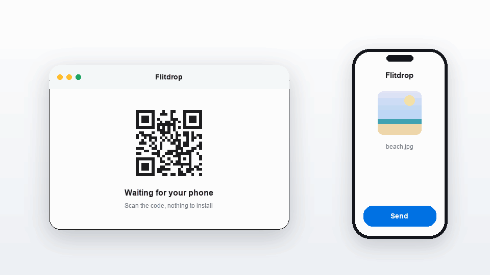
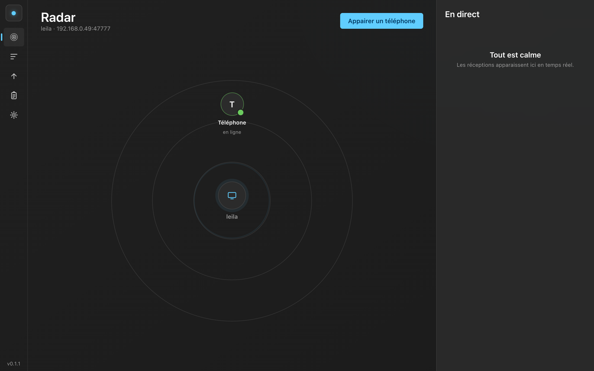
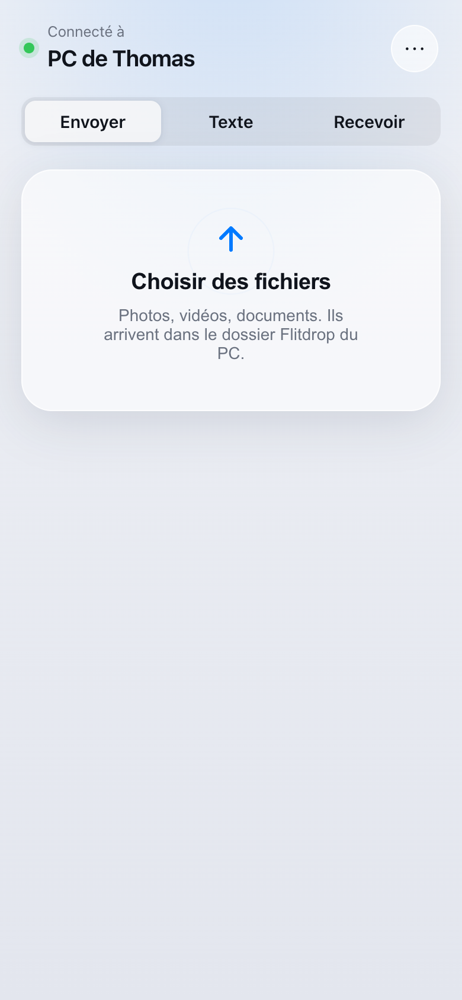
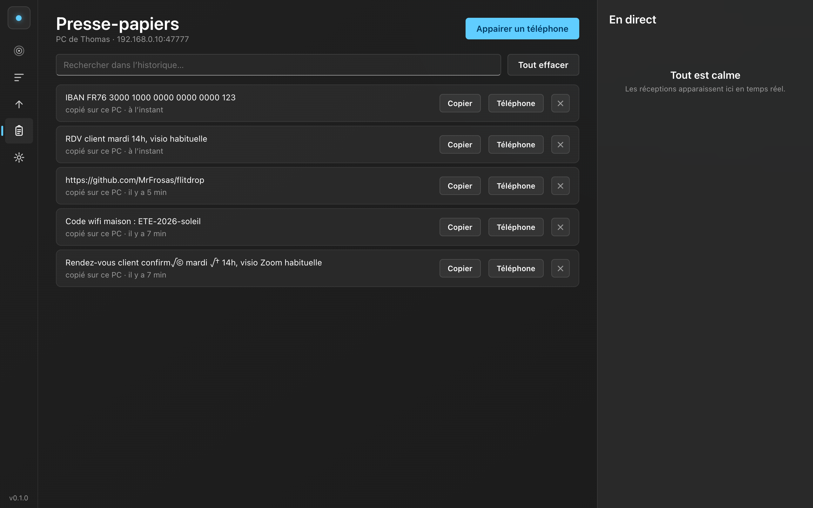

<div align="center">

# Flitdrop

### AirDrop for every device. Send files, photos and clipboard between any phone and any computer. Nothing to install on the phone. End-to-end encrypted. Free on your local network.

*Français plus bas.*

[](https://github.com/MrFrosas/flitdrop/releases/latest)

[](LICENSE)






[**Download**](https://github.com/MrFrosas/flitdrop/releases/latest) · [How it works](#how-it-works) · [Flitdrop vs AirDrop](#flitdrop-vs-airdrop) · [Français](#flitdrop-en-français)

</div>

---

## Why

macOS has AirDrop. Windows has nothing as simple, and there is no easy way to send a file from an iPhone to a PC **without installing an app on the phone**. Neither Microsoft (Phone Link, rated 3.0/5 across 460,000 reviews), nor Google (Quick Share, Android only), nor Samsung covers that case. Flitdrop does.

And it works **both ways, between every brand**: Windows, Mac or Linux on one side, iPhone, Android, Samsung or Xiaomi on the other. A Samsung phone talking to a Mac, an iPhone talking to a Windows PC, the same app handles all of it, which is exactly what AirDrop cannot do. Two phones can even swap files through the computer they are both paired with.

- **Phone to computer, nothing to install on the phone.** Scan a QR code once, then send from the browser or an Apple Shortcut.
- **Any phone, any computer, both ways.** iPhone, Android, Xiaomi, Samsung, and Windows, Mac and Linux.
- **End-to-end encrypted.** The key is exchanged through the QR code, never over the network. No cloud, no account.
- **Free on your Wi-Fi.** Files (several at once, up to 16 GB each), photos and videos in full quality, text, clipboard, both ways.

## What it does

| Device page (iOS Liquid Glass look) | Clipboard history (Windows 11 Fluent look) |
|---|---|
|  |  |

- **Send files** from phone to computer, several at once, with progress, speed, and **automatic resume** if the network drops. Up to 8 GB per file by default, adjustable up to 16 GB in the settings.
- **Clipboard sync**: text you copy on the computer becomes available on the phone automatically; text from the phone lands in the computer clipboard in one tap ([what is and isn't possible, and why](docs/clipboard.md)).
- **Clipboard history** on the computer, like the Paste app: everything you copy is kept locally, searchable, one click to copy again or push to the phone. Retention is configurable (by count and by age) so it never eats storage.
- **Computer to phone**: drop a file into Flitdrop, or right-click a file in Windows Explorer and choose **Send to → Flitdrop**.
- **Real-time radar** of paired devices, AirDrop style.
- **Offline mode**: with no router and no internet, the computer creates its own Wi-Fi network ([details](docs/offline.md)).
- **End-to-end encryption** with XChaCha20-Poly1305, out-of-band pairing, revocable devices.

## Install

**Download from the [releases page](https://github.com/MrFrosas/flitdrop/releases/latest)**, get it from the **[Microsoft Store](https://apps.microsoft.com/detail/XPDCK4DDN3LK69)**, or install from a package manager on Windows:

```powershell
# winget (Microsoft Store source)
winget install XPDCK4DDN3LK69 --source msstore

# Scoop
scoop bucket add flitdrop https://github.com/MrFrosas/scoop-flitdrop
scoop install flitdrop
```

- **Windows 10 and 11**: run the `.exe`, done. Installing also adds **Send to → Flitdrop** to the right-click menu in Explorer. The installer is code-signed (verified publisher: CC's Global); if SmartScreen still shows a prompt while the download reputation builds up, click **More info → Run anyway**. Flitdrop is also on the [Microsoft Store](https://apps.microsoft.com/detail/XPDCK4DDN3LK69). On Windows the app updates itself.
- **Mac**: open the `.dmg` for your Mac (`arm64` for Apple Silicon, `x64` for Intel), drag Flitdrop into Applications. The build is ad-hoc signed but not yet notarized by Apple, so on first open macOS may block it. Open it once, then go to **System Settings → Privacy & Security** and click **Open Anyway** (on macOS 14 or older, right-click the app and choose **Open** also works); if it says "damaged", run this once in Terminal: `xattr -cr /Applications/Flitdrop.app`. Until it is notarized, the Mac app does not install updates by itself either: it checks once a day and shows a **New version available** card with a button that downloads the right `.dmg`; drag the new Flitdrop into Applications to replace the old one. (These steps go away once the app is notarized.)
- **Linux (x64)**: on Ubuntu, Debian or Mint, the `.deb` is recommended: `sudo apt install ./Flitdrop-*.deb` (it does not update itself, so install each new version the same way). On any other distribution, use the `.AppImage`: make it executable (`chmod +x`) and run it; it updates itself. On Ubuntu 22.04 and later the AppImage may need the `libfuse2` package (`libfuse2t64` on 24.04 and later; the `.deb` does not need it). Clipboard sync needs `wl-clipboard` (Wayland) or `xclip` (X11); the `.deb` pulls them in automatically.

On first launch, a short walkthrough, then a QR code. Scan it with the phone once, and it stays paired, even after the computer restarts. No re-scanning.

**On the phone**, nothing to install. After scanning, you can add the page to the home screen (menu in Flitdrop, "Add to home screen"), and it behaves like a real app, already connected.

## How it works

The computer runs one small program that starts a local, encrypted server on your network. The phone talks to it through the browser (or an Apple Shortcut), on the same Wi-Fi, with end-to-end encryption on top. **Nothing goes through a cloud or an external server.** If there is no Wi-Fi at all, the computer makes its own network. Full detail in [docs/architecture.md](docs/architecture.md) and [docs/security.md](docs/security.md).

## Flitdrop vs AirDrop

| | Flitdrop | AirDrop |
|---|---|---|
| Works across brands (iPhone↔PC, Samsung↔Mac) | ✅ | ❌ Apple only |
| No app on the phone | ✅ browser + QR | n/a, system service |
| Windows, Mac and Linux | ✅ all three | Mac only |
| Offline (no router) | ✅ via the computer's hotspot | ✅ direct radio (Apple only) |
| Resume after a dropped connection | ✅ | ⚠️ often restarts |
| Clipboard history | ✅ | ❌ |
| Passive receive with the iPhone closed | ❌ (reserved to Apple) | ✅ |
| End-to-end encryption | ✅ | ✅ |

Full, honest comparison: [docs/airdrop-comparison.md](docs/comparatif-airdrop.md).

## Development

```bash
npm install
npm run dev        # local server + interfaces (port 47777)
npm test           # 38 tests: crypto, protocol, resume, security, clipboard history
npm run desktop    # desktop app (window + tray icon)
```

## Build the installers

Push a `vX.Y.Z` tag: GitHub Actions builds the signed Windows `.exe` and the Linux `.AppImage` and `.deb` into a draft release. The Mac `.dmg` files (arm64 and x64) are built locally and attached before the release is published. Locally:

```bash
npm run build -w @flitdrop/core
npm run dist:win -w @flitdrop/desktop        # Windows: .exe + .appx (Store)
npm run dist:mac -w @flitdrop/desktop        # Mac: .dmg (arm64 + x64)
npm run dist:linux:ci -w @flitdrop/desktop   # Linux: .AppImage + .deb (x64)
```

## Documentation

- [Architecture](docs/architecture.md) · [Security](docs/security.md) (with adversarial attack review)
- [Clipboard sync: the truth](docs/clipboard.md) · [Offline mode](docs/offline.md) · [iOS Shortcut guide](docs/raccourci-ios.md)
- [Native feasibility audit](docs/audit-faisabilite-native.md) · [Native apps roadmap](docs/roadmap-apps-natives.md)
- [Telemetry (anonymous basic stats on by default, detailed stats opt-in) and Cloudflare deploy](docs/telemetry.md)
- [Microsoft Store publishing](docs/microsoft-store.md) · [Business model](docs/business.md)

## Honest limitations

Flitdrop is young and free, and we would rather tell you the rough edges up front than have you find them mid transfer. Here is exactly what it does not do yet, and why.

- On Mac, the app is not notarized by Apple yet, so on the very first launch macOS Gatekeeper warns you about an "unidentified developer". The app is safe: open it once, then go to System Settings → Privacy & Security and click Open Anyway (on macOS 14 or older, right click and Open also works), and the code is public so you can check it yourself. Until it is notarized, the Mac app also does not install updates by itself: it tells you when a new version is out and downloads the right `.dmg` for you in one click. On Windows the installer is code-signed and the app is on the Microsoft Store; SmartScreen may still show a prompt while the download reputation builds up ("More info" then "Run anyway").
- There is no native app for your phone. Nothing installs on the phone, and that is on purpose: you scan a QR code once and it all happens in your browser. The trade off is that everything runs inside a web page instead of a dedicated app.
- Devices do not find each other automatically yet, so you scan a QR code to make the first connection. Automatic discovery on the local network is on the roadmap; for now the QR is the one small step that gets you paired.
- Your phone cannot receive a file while its screen is locked or the browser is in the background. Because the phone side is a web page and not a background app, keep the Flitdrop tab open and the screen awake during a transfer.
- Both devices have to be on the same Wi-Fi network. Flitdrop sends peer to peer over your local network, not across the internet, which is what keeps it fast and private. If you have no shared Wi-Fi, your computer can host a hotspot so the two still meet.
- Transfers go between a phone and a computer, both ways. Two phones can swap files through the computer they are both paired with, which acts as the hub, but there is no direct phone to phone or computer to computer transfer.
- Transfers have a size cap: 8 GB per file by default, which you can raise up to 16 GB in the settings. Folders are not sent as such; select the files inside instead.
- On Linux, the AppImage may need the `libfuse2` package on Ubuntu 22.04 and later (`libfuse2t64` on 24.04; the `.deb` does not), and clipboard sync needs `wl-clipboard` (Wayland) or `xclip` (X11), which the `.deb` pulls in automatically. Builds are x64 only for now.
- Flitdrop is source available under FSL-1.1-ALv2, not classic open source. The code is public and fully auditable, but the license blocks reselling it or building a competing product; each release turns into Apache 2.0 after two years. We would rather state this plainly than let anyone assume MIT.

## License

[Functional Source License (FSL-1.1-ALv2)](LICENSE): the source is public and free to use, including inside your company. You may not resell it or ship a competing product built from it. Two years after each release, that version automatically becomes Apache-2.0. AirDrop is a trademark of Apple Inc. Flitdrop is an independent project and has not been authorized, sponsored, or otherwise approved by Apple Inc.

---

# Flitdrop, en français

**L'AirDrop de tous vos appareils.** Envoyez fichiers, photos et presse-papiers entre n'importe quel téléphone et n'importe quel ordinateur. Rien à installer sur le téléphone. Chiffré de bout en bout. Gratuit sur votre réseau local.

Sur Mac il y a AirDrop, sur Windows rien d'équivalent, et aucun moyen simple d'envoyer un fichier d'un iPhone vers un PC **sans installer d'app sur le téléphone**. Flitdrop le fait, et **dans les deux sens, entre toutes les marques** : Windows, Mac ou Linux d'un côté, iPhone, Android, Samsung ou Xiaomi de l'autre. Un Samsung vers un Mac, un iPhone vers un PC, la même app gère tout, ce qu'AirDrop ne sait pas faire. Deux téléphones peuvent même s'échanger des fichiers via l'ordinateur auquel ils sont tous deux appairés.

**Installation** : téléchargez depuis la [page des releases](https://github.com/MrFrosas/flitdrop/releases/latest). Windows 10 et 11 : lancez le `.exe` signé (il ajoute aussi « Envoyer vers Flitdrop » au clic-droit), ou installez depuis le [Microsoft Store](https://apps.microsoft.com/detail/XPDCK4DDN3LK69) (en ligne de commande : `winget install XPDCK4DDN3LK69 --source msstore`), ou avec Scoop (commandes plus haut) ; sur Windows, l'app se met ensuite à jour toute seule. Mac : ouvrez le `.dmg` de votre Mac (`arm64` pour Apple Silicon, `x64` pour Intel), glissez Flitdrop dans Applications ; l'app n'est pas encore notarisée par Apple, donc au premier lancement ouvrez-la une fois, puis Réglages Système → Confidentialité et sécurité → Ouvrir quand même (sur macOS 14 ou plus ancien, clic droit puis Ouvrir fonctionne aussi) ; si macOS la dit endommagée, lancez une fois en Terminal `xattr -cr /Applications/Flitdrop.app`. Sur Mac, les mises à jour ne s'installent pas encore toutes seules : l'app vérifie une fois par jour et affiche une carte « Nouvelle version disponible » avec un bouton qui télécharge le bon `.dmg`. Linux (x64) : le `.deb` pour Ubuntu, Debian et Mint (recommandé ; il ne se met pas à jour tout seul), ou l'`.AppImage` pour toutes les distributions (il se met à jour tout seul ; sur Ubuntu 22.04 et plus récent, il peut demander le paquet `libfuse2`, `libfuse2t64` à partir de 24.04). La synchro du presse-papiers demande `wl-clipboard` (Wayland) ou `xclip` (X11), que le `.deb` installe automatiquement. Au premier lancement, un QR code à scanner une fois avec le téléphone, et c'est appairé pour de bon.

**Ce que ça fait** : envoi de fichiers, plusieurs d'un coup, jusqu'à 8 Go par fichier par défaut (16 Go dans les réglages), avec reprise automatique, synchro et historique du presse-papiers façon Paste (local, cherchable, rétention réglable), envoi PC vers téléphone (glisser ou clic-droit), radar temps réel, mode hors-ligne sans box, chiffrement de bout en bout.

Documentation complète en français dans le dossier [docs/](docs/) : architecture, sécurité, [synchro presse-papiers](docs/clipboard.md), [mode hors-ligne](docs/offline.md), [comparatif AirDrop](docs/comparatif-airdrop.md), audits de faisabilité, feuille de route.
